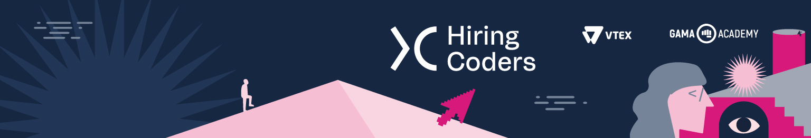

<h1 align="center">
    
</h1>

<h1 align="center">DESAFIO LANDPAGE</h1>

Repositório criado para conter o desafio LandPage do treinamento Hiring Coders.

    
    
    
    

<h4 align="center"> 
	🚧  Em aperfeiçoamento...  🚧
</h4>

Veja o resultado aqui: [Loja de Doces da Doroti](https://dorotidoces.netlify.app/)

Neste desafio foi desenvolvido uma landpage de desconto, em que se é preciso fornecer o nome e e-mail. Estes dados serão salvos em Localstorage.

Na parte dois do desafio, foi desenvolvido duas funcionalidades, a de adicionar o produto e a quantidade, também salvo em Localstorage.

Obs.: Para testes da funcionalidade, utilize o produto "Macarrons"; Demais produtos por hora não possuem a funcionalidade.

E de finalizar a compra, sendo redirecionado para uma nova página onde informará alguns dados em um forms. Os dados do forms também serão salvos em Localstorage.

    Desafio realizado com ❤️ por Jéssica Nepomuceno!

